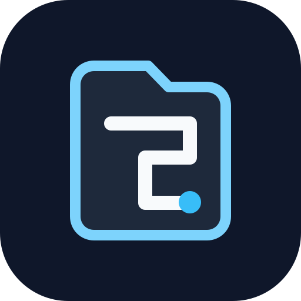

<div align="center">

<picture>
  <source media="(prefers-color-scheme: dark)" srcset="assets/daedalus-mark.svg">
  
</picture>

# Daedalus

**A local-first utility belt for a calmer browser.**

[](https://developer.chrome.com/docs/extensions/develop/migrate/what-is-mv3)
[](https://www.typescriptlang.org/)
[](https://bun.sh/)
[](LICENSE)

</div>

Daedalus helps you save browser work, remove stale tabs safely, and inspect what a page is doing—without an account, backend, telemetry, or analytics.

## What it does

| Tool | Purpose |
|---|---|
| **Read later** | Save a window's tabs as a named, tagged list—keeping them open or closing them. Lists show their items: open one, reorder either level, add the current tab, rename and retag in place. |
| **Tab cleaner** | Close tabs left idle past a configurable threshold, optionally filing them into a read-later list first. Keep a domain safe by adding it to the exclusion list, and reopen anything it closed this session. |
| **Page controls** | Dark mode with an adjustable brightness and per-domain exceptions, autoplay blocking, per-site JavaScript blocking, and cookie-banner rejection—each on its own page, with the list of sites it applies to. The four per-site switches are also in the popup, for the page you are looking at. |
| **Redirect trace** | Every URL the browser visited on the way to the current page, with the status code of each hop, copyable as text. |
| **Cookie editor** | Cookies for the domains open in the current window. Open one to edit every field it has—value, name, domain, path, SameSite, secure, httpOnly—or add and delete them, alongside JSON import and export. |
| **YouTube unhook** | Hide the home feed, the suggestions beside the player, end screens, and Shorts—each one its own switch. Search still works. |
| **Picture-in-Picture** | Float the largest video on the page from the manager, with **Alt+P**, or from the page context menu. |
| **JSON formatter** | Render `application/json` responses as indented, highlighted, readable text. A browser that ships its own JSON viewer (Opera) keeps it—Daedalus takes its theme back off the page and stands aside. |
| **Image search** | Right-click any image to search it with Google Lens, Bing, or Yandex—the image URL is sent, never the bytes. |
| **UA headers** | Apply built-in, session-only user-agent headers to matching tabs in one window. |

Everything but saving lives in the manager: the Chrome side panel, or the same page as a full tab from **Extension options**. Browsers without the side panel API open it as a tab instead.

### How two of them work

**Dark mode** inverts the page with a stylesheet rather than inline styles, so elements added later are covered too. Images, video, and CSS background images are inverted back, so only the chrome around them changes. After the page renders it samples the painted background at four points—`html` and `body` are transparent on plenty of sites—and drops the inversion when the page is already dark, instead of turning it light. That verdict is remembered per site, so a site with its own dark theme only flashes once; every load re-measures and corrects the note. Brightness rides on the same filter, after the inversion, so it acts on the dark result—and does nothing at all on a site whose inversion was dropped.

**Autoplay blocking** replaces `HTMLMediaElement.prototype.play` from the page's own JS world and dispatches synthetic `play`/`playing`/`pause` events, so a player that would retry believes playback started. Pausing after the fact instead makes feed players fight back in a loop that freezes the tab. It covers iframes, and strips the `autoplay` attribute that declarative `<video autoplay>` uses without ever calling `play()`. Playback within a second of a click or keypress is always yours, so pressing play works.

## Privacy by default

- **Local-first:** read-later groups stay in `chrome.storage.local`.
- **Minimal sync:** only compact preferences and per-site rules use Chrome Sync.
- **Session-scoped:** restore history and UA rules disappear when the browser session ends.
- **No hidden requests:** Daedalus only opens a provider URL when you explicitly choose reverse-image search.
- **No Incognito support:** the extension is explicitly disabled there.

## Install from source

```bash
git clone https://github.com/jvillegasd/daedalus.git
cd daedalus
bun install
bun run build
```

Open `chrome://extensions`, enable **Developer mode**, select **Load unpacked**, then choose `.output/chrome-mv3`.

## Development

```bash
bun run dev     # Watch and rebuild
bun test        # Unit tests
bun run build   # Production extension
```

## Safety notes

The cleaner never closes active, pinned, audible, excluded-domain, or detected-unsaved-form tabs, and it skips any tab whose idle age the browser can't report. It is still a destructive action: add important sites to "Never close these", or turn on saving to a list so closed tabs are kept.

The "Recently closed" list is session-scoped and empties when the browser does. Saving to a read-later list is the durable option.

Chrome cookies are profile-wide. Daedalus filters its cookie view to domains open in the selected window, but it does not create isolated cookie jars. Editing or deleting a cookie there changes the profile's real cookie, and can sign you out.

Blocking JavaScript writes a Chrome content setting for the site, so it outlives the extension being disabled. Turning it back off writes an explicit "allow" — Chrome has no way to remove a single site rule.

UA profiles change the request header only; they do not emulate a device, browser engine, or viewport.

## License

[MIT](LICENSE)
